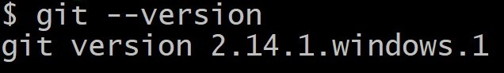
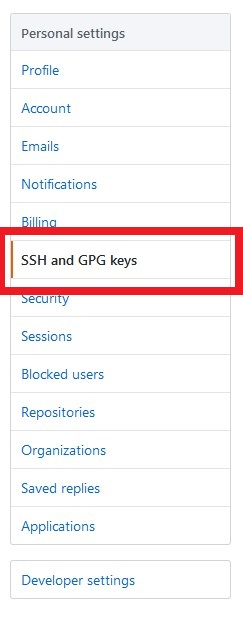
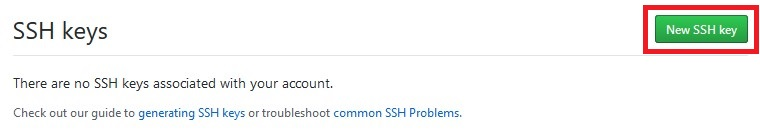
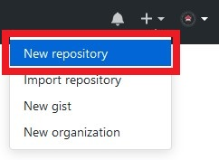
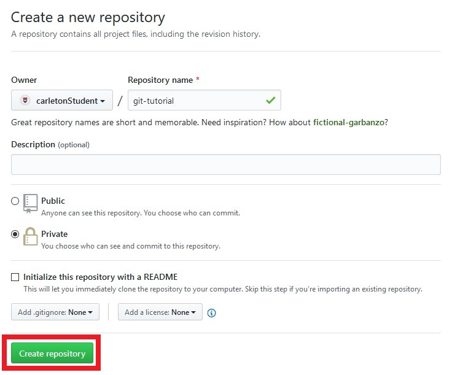
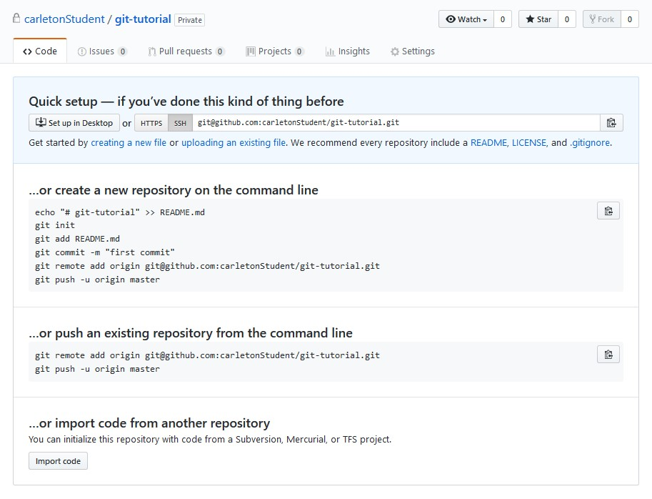
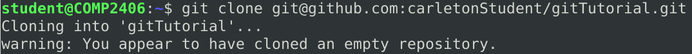
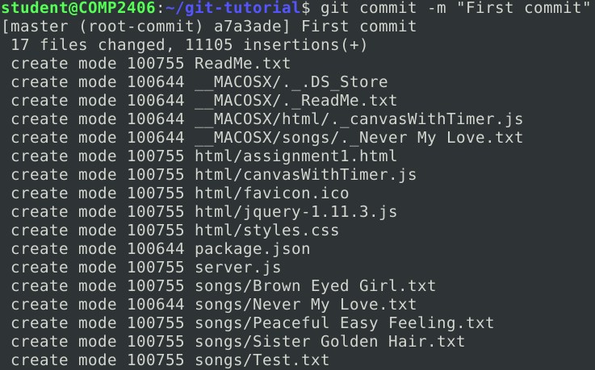
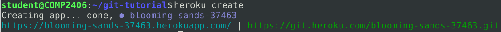
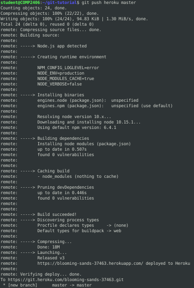

# COMP 2406 - Winter 2019 Tutorial Git & Heroku
## Introduction to Git & Heroku

© Omar Garcia Flores & L.D. Nel 2019

Revisions:

---

## Description:

The purpose of this tutorial is for you to be introduced to one of the most important collaboration tools in the industry, **Git**. The use of this tool in various workplaces is a common practice and will be useful for various other courses such as COMP3004.

As background for this tutorial it is recommended that you look over the Git documentation in the following website https://guides.github.com/introduction/git-handbook/

To learn more about version control software and Git, refer to the following website: https://git-scm.com/about

Tutorial grading: 0,1,or 2 marks. 0 marks for no show or no progress. 1 mark for partial completion, and 2 marks for completing all or most of the tutorial. Important: tutorials are meant to be started as homework. You will not generally be able to finish a tutorial if you only start it at the tutorial session.

---

## - Overview
In this tutorial you will create a **Github Repository** and deploy the Assignment 1 answer code on a **Heroku** remote image.

---

## Instructions:

---

# Part 1 Installing Git

**If you are working on a lab computer, make sure to check that Git is already installed and skip to part 2.**

Head to https://git-scm.com/downloads, download and install git. Follow the installation insctructions according to your operating system.

After installing, go on your terminal and enter the following command:

- `$ git --version`

A message similar to the following should be displayed:

## Before moving forward

After installing Git, you should have the following program in your system: 

- **Git Bash**

Git bash is a Unix shell command line for Windows, a very powerful tool.

## Make sure to use this terminal moving forward in the tutorial.

# Part 2 Creating a GitHub account, creating an SSH key and adding it to your account

## - New GitHub account

Head to http://github.com and create a new account. If you already have one, skip to the next step.

## - Generating a SSH key

To learn more about SSH keys, head to https://help.github.com/en/articles/about-ssh.

Open your terminal and enter the following command: 

- `$ ssh-keygen`

Press enter on every question prompted.

This will generate a very long string, this is an SSH key.

To display the generated key, enter the following command: 

- `$ cat ~/.ssh/id_rsa.pub`

## **Copy the generated SSH key.**

## Important

**Do not share your ssh key with anyone.**

## - Adding the key to your GitHub account 

Head back to GitHub and click on the plus (**+**) sign on the top right corner and then on **Settings**.

Once on the **Settings** page, click on **SSH and GPG keys**, the folllowing page should be displayed: 

Click on **New SSH key**

You should have the following options, fill them with your ssh key and give it a name of your choice.

You have succesfully added an SSH key to your account.

# Part 3 Making a repository and cloning it to your computer

## - Creating a new repository

Click on the plus (**+**) sign on the top right corner and then on **New repository**

You should then arrive at the following page: 

## - Important
- **Make sure to select Private**
- It is not necessary to initialize this repository with a README for the purpose of this tutorial.

Then click on Create repository (Green button)

After creating the repository you should see the following screen: 

## - Cloning the repository

At the top of the page, click on SSH, and then copy the given link.

Using your terminal, head over to the directory in which you would like to clone this repository to (i.e. Documents/ GitHub Projects, etc.)

Enter the following command: 

- `$ git clone <paste ssh link here>`

Git will now clone the repository to the given directory, it should look like this:

# Part 4 Modifying the answer code

Make the following modifications to the answer code of assignment one in the demo_code directory.

Open the server file with a text editor and make the following changes: 

- In line 149 make the following edit: 
  - replace `.listen(3000)` with `.listen(process.env.PORT || 80)`

**This change must be made since we do not know the port that will be assigned to our server on heroku**

## - Creating a package.json file

Open a terminal in the current demo_code directory and enter the following command: 

- `$ npm init`

You will be prompted with a series of questions, press the Enter key **until you reach the option**:

- **Test Command:**
  
When prompted to enter a **Test Command** , enter the following: 

- `node server.js`

Continue to press the Enter key for the rest of the questions. 

The final result should look like the following: 

**By the end of this step you should have generated a package.json file**

## - Moving the code

**Copy** every file and directory inside of the given demo_code directory.

Head to the directory you cloned from GitHub in **step 3** and paste all the copied items.

You should now have the following items on your cloned directory: 

- [x] _MACOSX
- [x] html
- [x] songs
- [x] .DS_Store
- [x] package.json
- [x] ReadMe.txt
- [x] server.js
- [x] README.md (optional)

# Part 5 add, commit, and push your changes
Before moving on, we must tell git who we are by entering the following command: 

- `$ git --global set user.email "youremail@gmail.com"`

Git keeps track of the changes we've made to the current working directory, this can be verified by entering the following command: 

- `$ git status`

As you can see, Git will tell us that there are serveral files that are untracked and modified.

## - Adding the changes (tracking)
We must first tell Git who we are by entering the following command: 

- `$ git config --global user.email "you@example.com"`

To add the modified files to the current work stream, enter the following command: 

- `$ git add -A`

This will have added the changes to the stream, now we have to stage these changes.

## - Commiting changes (staging)

To stage our changes (also know as "commit") we will enter the following command: 

- `$ git commit -m "Commit message"`

This will have commited and staged the changes made to the stream.

## - Pushing changes 

- `$ git push`

This will push the changes we've made to the cloud repository. 

# Step 6 Installing Heroku and creating an account 

## - Creating an account 

Head to https://www.heroku.com/ and click on the **Sign up** button.

After completing the sign up process, you should arrive at the main dashboard, once you arrive at this screen, move on to the next step.

## - Downloading and installing Heroku

Head to https://devcenter.heroku.com/articles/heroku-cli#download-and-install and follow the install instructions according to your operating system. 

After following these steps, enter the following command to verify the installation was succesful: 

- `$ heroku --version`

# Step 7 Creating a Heroku remote image and pushing the repository onto it

## - Creating the remote image 

In the same directory where step 5 took place, enter the following command:

- `$ heroku create`

This will redirect you to Heroku's website to log in. Once loged in, it will generate a remote image and provide you with a link to access this server.

---

**Note** that heroku generates a random name for our project by default. However, if a string with the desired url name is provided, heroku will attempt to give us such url. For example: 

- `$ heroku create "tutorial"`

This command will attempt to create a heroku image with such name, however if it is already taken, it will fail.

---

## - Pushing our repository to the heroku image

Enter the following command after having created the remote image: 

- `$ git push heroku master`

This will deploy our app to the heroku server. This will seem like a lot of information but it will tell you whether or not the deployment was succesful.

After having deployed the app, access the link and **make sure to add /assignment1.html**.

The final result should be a working app on a heroku server:

---

## **Important**

If you used the lab computer to complete the tutorial, **REMOVE** the ssh key you added from your GitHub account.

---

## Call a TA to show your progess.

---

## The TAs will be hosting workshops to help you develop your Git skills as well as other collaboration tools.

---

# Suggested excercises

Attempt to create a collaborative repository with another student. Create a branch and create a pull request with your changes.

Branching and merging:
https://git-scm.com/book/en/v2/Git-Branching-Basic-Branching-and-Merging

Creating a pull request:
https://help.github.com/en/articles/creating-a-pull-request